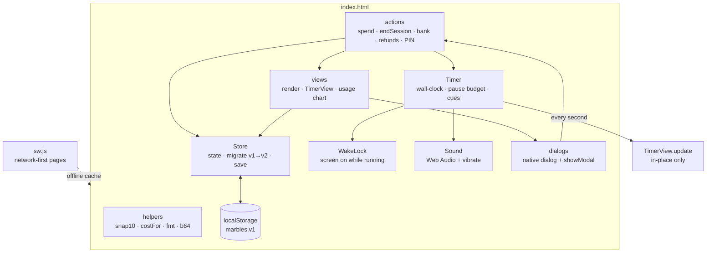

# Marbles — Technical Documentation

> The kid-friendly overview is in [README.md](README.md). This file is the full
> reference for grown-ups, developers and code review.

A calm, offline **screen-time bank and timer** for one child. The child earns
**physical marbles** at home for chores. That part stays offline on purpose,
because the marble is the reward. The app handles the *spending*: marbles buy
game time in 10-minute steps, spare marbles are banked toward bigger rewards,
and grown-ups manage everything behind a PIN.

- **One file.** `index.html` is the entire app: no build step, no runtime
  dependencies, no external requests, no accounts, no tracking.
- **Offline.** All state lives in `localStorage`.
- **Installable.** PWA, and packaged as an Android `.apk` via PWABuilder.

---

## Contents

- [Quick start](#quick-start)
- [How it works (for parents)](#how-it-works-for-parents)
- [Deploying & installing](#deploying--installing)
- [Updating the installed app](#updating-the-installed-app)
- [Data & persistence](#data--persistence)
- [Architecture](#architecture)
- [Data model](#data-model)
- [Design decisions](#design-decisions)
- [Testing](#testing)
- [Known limits](#known-limits)
- [File manifest](#file-manifest)

---

## Quick start

Open `marbles.html` (single file, works from disk) or `index.html` in a modern browser. On the very first launch a grown-up must
choose a 4-digit PIN (`1234` is refused). After that the Grown-ups panel opens
so you can add the marbles already earned.

---

## How it works (for parents)

Four tabs sit along the bottom:

| Tab | Who | What |
| --- | --- | --- |
| **Home** | child | Marble pot, **Spend marbles**, live timer, first savings goal |
| **Bank** | child | All goals: add a marble, take one back, claim when full |
| **Usage** | PIN | 14-day chart of minutes *actually played*, marbles in/out, history |
| **Grown-ups** | PIN | Add or remove marbles, activities & rates, goals, PIN, sound, backup |

After a correct PIN, Usage and Grown-ups stay unlocked for 3 minutes, so
there's no retyping. Leaving the app locks them again straight away.

### Spending

1. **Spend marbles** → pick an activity (e.g. *Games · 20 min / marble*) → set
   the time with **−/+** in 10-minute steps.
2. Cost = `ceil(minutes ÷ minutes-per-marble)`. If the chosen time is less than
   the marbles pay for, a **Same price: 40 min. Use it all** button offers the
   paid-for minutes, so nothing is wasted without the child seeing it.
3. **Start** deducts the marbles and starts a wall-clock timer that survives
   reloads and screen locks.

### During the timer

- **Pause** draws from a **5-minute budget per session**. When the budget runs
  out, the clock restarts by itself. There's no pausing for ever.
- **Sounds:** a note at 1 minute, two notes at 10 seconds, and a chime plus a
  buzz at zero. Each plays once. If the app was in the background, only the
  most urgent missed sound plays when it comes back, not all three together.
- **Screen stays on** (Screen Wake Lock) while the timer runs, so the alarm can
  actually ring. See [Known limits](#known-limits).
- **Done** asks first ("Stop now? 35 min left. You get 1 marble back."). Every
  whole marble of unused time is refunded. Time played past zero is recorded.

### Usage chart

Minutes shown are **minutes actually played** (from start to Done, pauses
excluded, overtime included), not minutes bought. *In / out* counts marbles:
marbles earned versus marbles spent, net of refunds. Tap anywhere in a day's
column to see that day.

### Security

- The PIN is set on first launch. The default `1234` is refused, and existing
  installs still on `1234` must change it at the next unlock.
- **5 wrong tries lock the keypad**: 1 min, then 2, 4 … up to 15 min. The lock
  is stored, so reloading doesn't reset it.
- Backup codes **never contain the PIN** or the lock state.

---

## Deploying & installing

### Option A — home-screen PWA (easiest)

1. Unzip `marbles-site.zip`. The files must sit at the **root** of what you
   deploy (`index.html` at the top level, not inside a subfolder).
2. Drag the folder onto **[Netlify Drop](https://app.netlify.com/drop)**, or
   drop it on an existing site's *Deploys* tab to update it.
3. On the phone: open the URL in Chrome → menu → **Install app**.

### Option B — real .apk

<a name="make-an-android-apk"></a>

1. Do Option A first (PWABuilder needs a live HTTPS URL).
2. **[PWABuilder](https://www.pwabuilder.com/)** → enter the URL → check you see
   the name, the icon and green checks (a "Missing Name" result means the
   manifest isn't at the site root).
3. **Package For Stores → Android → Generate.** The zip contains the signed
   `.apk`, `signing.keystore` and its passwords.
4. Install the APK on the phone. You'll need to allow installs from unknown
   sources once.

> **Keep the keystore private and backed up.** A future APK must be signed
> with the same key, or Android forces an uninstall, which wipes the marbles.
> `.gitignore` blocks `*.keystore` and `*.apk` from ever being committed.

---

## Updating the installed app

The APK is a Trusted Web Activity: it loads the Netlify site. **App changes
don't need a new APK.** Redeploy the site, and `sw.js` fetches pages
network-first, so the next launch while online picks up the new version.
Offline launches use the cached copy. Rebuild the APK only if the manifest,
icon or package name changes, and use the same keystore when you do.

---

## Data & persistence

All state is one JSON object in `localStorage` under the key `marbles.v1`
(the key name stayed the same; the schema is now `v: 2`).

**Survives:** closing the app, reboots, and app updates.
**Lost by:** clearing the app's storage, or opening from a different origin (a
loose `file://` copy has its own storage). The app asks the browser for
**persistent storage** so it won't be evicted when the phone is low on space.

**Backup:** Grown-ups → *PIN, sound & backup* → **Show backup code** (UTF-8
JSON, base64-encoded, without the PIN). **Restore from code** checks the code,
shows *now vs backup* marble counts, asks you to confirm, and keeps the current
PIN. Codes from the old version still restore.

---

## Architecture

Single file, internally split into modules with one job each:



**Data flow:** a user action calls an *action*, which changes `Store` and then
calls `render()`, which rebuilds the page from state. The one exception is the
**timer tick**: once a second it calls `TimerView.update()`, which changes
only the clock text, the ring and the button labels. Nothing else redraws, so
animations don't replay, open sections stay open, and the ring moves smoothly.

| Module | Owns |
| --- | --- |
| `Store` | State, persistence, **v1 → v2 migration** (rates snapped to 10, history repaired, old session shape converted, `setupDone` inferred) |
| `Timer` | Session engine: `endTs`-based clock, 5-min pause pot with auto-resume, cues played once (`session.cues`) |
| `WakeLock` | Requests `navigator.wakeLock('screen')` while a session runs, is visible and isn't paused; asks again when the app comes back |
| `Sound` | Synthesised tones, no audio files; resumes a suspended `AudioContext` |
| actions | `spendMarble` (works out the cost itself and refuses to overspend), `endSession` (refund + minutes played), `addToBank`, `withdrawFromGoal`, `claimGoal`, `applyGoals` (refunds on delete or price cut), `applyActivities`, `grantMarbles`, `removeMarbles`, backup/restore |
| views | `render()`, `TimerView`, `buildChart()` (SVG, full-height tap columns) |
| dialogs | `<dialog>` + `showModal()`: focus trap, Esc/back to close, `closedby="any"` with a fallback; the setup screen can't be dismissed |

---

## Data model

```jsonc
{
  "v": 2,
  "marbles": 4,
  "pin": "5678",
  "setupDone": true,
  "soundOn": true,
  "activities": [ { "id": "game", "name": "Games", "minutes": 20 } ],   // minutes: multiple of 10
  "goals":      [ { "id": "movie", "name": "Movie night", "cost": 5, "saved": 3 } ],
  "history": [                                     // newest first, capped at 300
    { "type": "spend", "minutes": 60, "played": 35, "delta": -3, "activity": "Games" },
    { "type": "refund", "delta": 1, "from": "session" },   // or "goal"
    { "type": "earn", "delta": 2 }, { "type": "save", "delta": -1 },
    { "type": "adjust", "delta": -1 }, { "type": "claim" }
  ],
  "session": {                                     // null when no timer
    "label": "Games", "totalSec": 3600, "endTs": 0,
    "pauseStart": null, "pauseLeftSec": 300,
    "rate": 20, "marbles": 3, "spendId": "…",
    "cues": { "warn": true, "last": false, "end": false }
  },
  "pinFails": 0, "lockUntil": 0, "lockLevel": 0
}
```

**Usage maths:** minutes = `played ?? minutes` on spend events; out = marbles
spent − session refunds; in = earn deltas. Banking isn't spending.

---

## Design decisions

- **Earning stays physical.** A grown-up adds the marbles already earned; the
  app never creates marbles on its own.
- **No borrowing, no overspending.** The cost is always worked out from the
  activity's rate, never taken from the caller.
- **Nothing silently lost.** Spare paid-for minutes are shown, Done refunds
  whole marbles, and deleting a goal or cutting its price returns banked marbles.
- **Pause is limited, not banned.** A 5-minute pot covers dinner calls without
  becoming a way to freeze the clock.
- **Usage is descriptive and PIN-locked.** Real played minutes, with no score
  and no target.
- **Amber is the only warm colour** on the silver-black theme.

---

## Testing

`tests/test_marbles.py` has 30 checks that drive the real `index.html` in
Chromium (Playwright):

```bash
pip install pytest playwright
python -m playwright install chromium
pytest tests -q
```

They cover:

- **Setup and PIN:** first-run setup can't be dismissed and refuses `1234`;
  existing installs must change the default; the lockout survives a reload and
  expires; the 3-minute grace window.
- **Spending:** the spend screen's cost maths; rates snapping to 10 minutes;
  the "same price" offer; overspending and a second timer refused.
- **Timer:**
  - the pause budget restarts the clock by itself;
  - a manual resume uses up part of the budget;
  - catching up from the background plays one sound, once;
  - sounds play in order;
  - no page redraw on each tick;
  - the timer survives a reload;
  - Done asks first, refunds, and records minutes played.
- **Bank:** refunds when a goal is deleted or its price cut; add, take back
  and claim.
- **Usage:** figures count marbles and minutes played; chart tap areas are
  finger-sized.
- **Grown-ups and backup:** the panel shows the balance, and toasts sit above
  dialogs; backups exclude the PIN; restore keeps the PIN; old backup codes
  still work.
- **Migration:** v1 data moves to v2.
- **Accessibility and layout:** zoom allowed; real buttons with `aria-pressed`
  and `aria-current`; no overflow or clipped text at 320px (1×/2×/3×); the
  count pill for more than 12 marbles; the old purple theme is gone.

---

## Known limits

- **Background alarm.** Android freezes web timers when another app is in the
  foreground. The alarm rings reliably when Marbles stays on screen, and the
  screen is kept awake for this. That fits play on a TV, console or tablet.
  If she plays on the **same** phone, the sound comes when she returns to
  Marbles. A true background alarm needs a native wrapper (e.g. Capacitor
  local notifications), which a PWA or TWA can't provide.
- **Clearing app storage** (Android Settings → Apps → Marbles → Clear storage)
  resets everything, including the PIN. Keep a backup code.
- **iOS Safari** can't vibrate from the web. Sounds work after the first tap.

---

## File manifest

| File | Purpose |
| --- | --- |
| `index.html` | The entire app, hosted PWA version (edit this one) |
| `marbles.html` | **Generated** standalone copy: icon inlined, no manifest or service worker, zero other files needed. Rebuild with `python3 build_standalone.py` (a test fails if it's stale) |
| `build_standalone.py` | Builds `marbles.html` from `index.html` |
| `manifest.webmanifest` | PWA manifest (static, as PWABuilder requires) |
| `icon-192.png`, `icon-512.png` | App icons (512 also maskable) |
| `sw.js` | Service worker: network-first pages, offline fallback |
| `_headers` | Netlify MIME types and no-cache for the manifest and `sw.js` |
| `tests/test_marbles.py` | Playwright behaviour tests (not deployed) |
| `screenshots/` | README images |
