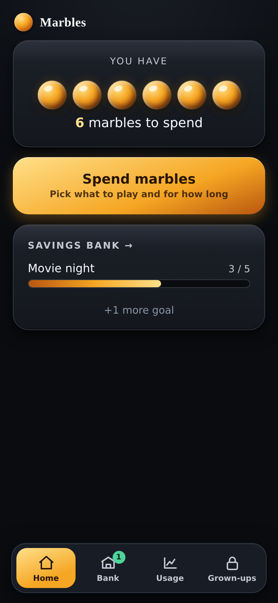
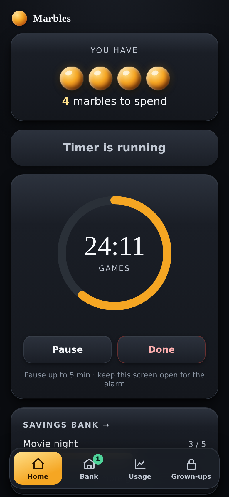
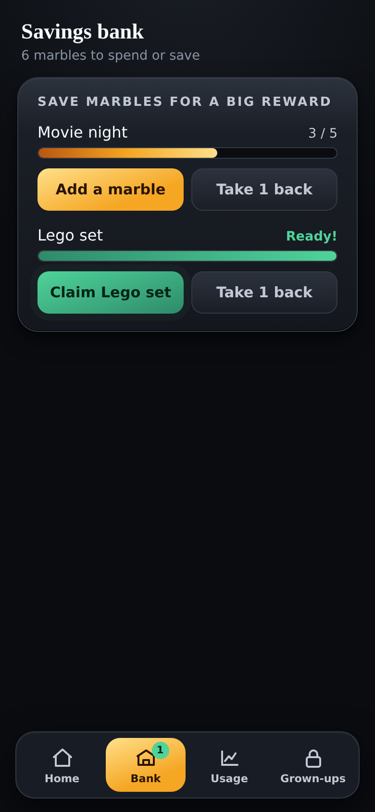
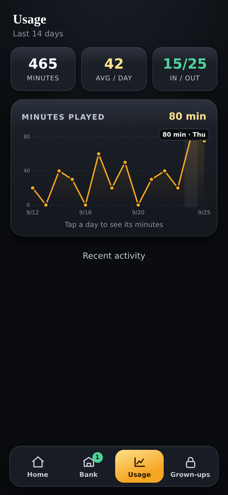

# 🔴 Marbles

**Turn marbles you earn into game time!**

You do jobs around the house and earn real marbles. Each marble is worth some
minutes of game time. This app is like a **piggy bank and a timer** for your
marbles. 🕹️

It works with **no internet**. Everything stays on your phone.

---

## 📱 What it looks like

| Home | Timer |
| --- | --- |
|  |  |

| Bank | Grown-up chart |
| --- | --- |
|  |  |

---

## 🎮 How to use it

There are four buttons at the bottom.

- 🏠 **Home** — see how many marbles you have. Tap **Spend marbles**, pick what
  to play and use **−** and **+** to choose the time (10 minutes at a time).
  A circle counts down the minutes.
- 🏦 **Bank** — save marbles for something big, like a movie night. When you
  save enough, a **Claim** button pops up! 🎉 Changed your mind? **Take 1 back**.
- 📈 **Usage** — a chart for grown-ups (locked with a secret code).
- 🔒 **Grown-ups** — where a parent adds the marbles you earned (also locked).

When your time is almost up, the app makes a little sound so you know. 🔔
Keep Marbles open on the screen while you play on the TV or console, so you
can hear it. The screen stays on by itself while the timer runs.

---

## 🧑‍🍳 The rules (why it's fair)

- You earn **real marbles** for real jobs. The app doesn't give you marbles —
  a grown-up adds the ones you already earned. ✅
- One marble = your game-time minutes (a grown-up picks how many).
- You **can't borrow** marbles you don't have yet. No going into the minus!
- Marbles you don't spend can be **saved** for a bigger reward. 💎
- ⏸️ You can **pause** for up to 5 minutes in total. After that the clock
  starts again by itself.
- 🛑 Stopping early? Tap **Done**. Every whole marble of time you didn't use
  comes back to you.
- 💡 If you pick less time than your marbles pay for, the app shows
  **Same price: 40 min. Use it all** so you never waste minutes.

---

## 🚀 How to run it

**The easy way (just try it):**
Double-tap `marbles.html` and it opens in your web browser. Done! It's one
file with everything inside, so you can copy it anywhere.

**The proper way (put it on your phone like a real app):**

1. A grown-up puts the files online for free with
   [Netlify Drop](https://app.netlify.com/drop) — just drag the folder in.
2. Open the web link it gives you, in Chrome on the phone.
3. Tap the menu (⋮) → **Install app** / **Add to home screen**.
4. Now it has its own 🔴 marble icon and opens like a normal app!

> 🔑 **Secret code:** the first time the app opens, a grown-up picks a 4-digit
> PIN (`1234` isn't allowed). Five wrong tries lock the keypad for a while.

Want it as a real Android app (`.apk`) you can install? See
[DOCS.md](DOCS.md#make-an-android-apk).

---

## 💾 Will my marbles stay saved?

Yes! Your marbles are saved on the phone. They stay even if you:

- close the app 👍
- turn the phone off and on 👍
- update the app 👍

Just don't press "clear browsing data" — that erases them. A grown-up can make a
**backup code** in the settings to keep them extra safe. 🛟

---

## 🛠️ For grown-ups & developers

The nerdy details — how it's built, the data model, testing, deploying, and
making the `.apk` — are in **[DOCS.md](DOCS.md)**.

Quick facts:

- **One file.** The whole app is `index.html`. No build step, no libraries, no
  internet needed. 📦
- **Where stuff is saved:** your browser's `localStorage`, key `marbles.v1`.
- **Made with:** plain HTML, CSS and JavaScript. The chart and marbles are drawn
  by hand (SVG) — nothing is downloaded.

---

## 📂 What's in this project

| File | What it is |
| --- | --- |
| `index.html` | The whole app. This is the important one. |
| `marbles.html` | The same app in **one single file**. Open it straight from your computer or send it to anyone. |
| `build_standalone.py` | Makes `marbles.html` from `index.html`. |
| `manifest.webmanifest` | Tells the phone the app's name and icon. |
| `icon-192.png`, `icon-512.png` | The 🔴 marble icon. |
| `sw.js` | Helper that makes it work with no internet and pick up updates. |
| `tests/` | Automatic checks that make sure nothing breaks. |
| `_headers` | A setting for the Netlify website host. |
| `screenshots/` | The pictures used in this README. |
| `DOCS.md` | The full technical guide. |

---

## 📜 License

Made for one family, but you're welcome to use and change it. See
[LICENSE](LICENSE).

---

*Built with ❤️ — everything runs on your phone, nothing is sent anywhere.*
